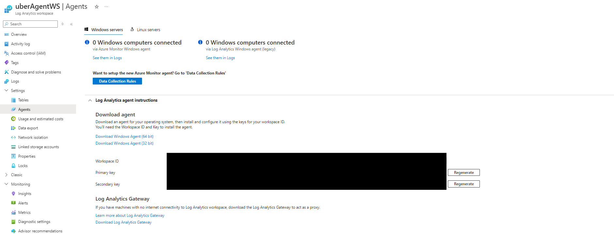

## Integration with Azure Monitor

uberAgent can be configured to send the collected data to Microsoft Azure Monitor (Log Analytics).    
The configuration steps are captured in the [documentation](https://docs.citrix.com/en-us/uberagent/current-release/installation/backend/configuring-microsoft-azure-oms-log-analytics).

Different tools can then be used to visualize the collected and stored metrics. Pre-built dashboard definitions can be found for
* Azure Workbooks
* Grafana
* PowerBI


### Creating Azure Log Analytics workspace

1. Log in to the Azure portal
2. In all services, search for Log Analytics workspaces.
 
3. Create a new workspace within the desired Subscription and Resource group

### Integrating uberAgent with Log Analytics workspace

1. Open the `uberAgent.conf` file.
   
       
For uberAgent 7.3 and above, `uberAgent.conf` is located in `Program Data\vast limits\uberAgent\Configuration` folder. For older versions, it is located in installation directory itself - `C:\Program Files\vast limits\uberAgent` by default. 
Reference:
[documentation](https://docs.citrix.com/en-us/uberagent/current-release/installation/installing-uberagent/installing-the-endpoint-agent#configuration).

2. Add the following Receiver entry in it.

```
[Receiver]
Name = Default
Type = OMSLogAnalytics
Protocol = HTTP				
Servers = https://<log-analytics-workspace-id>.ods.opinsights.azure.com
RESTToken = <log-analytics-primary key>
```
* Workspace ID and Primary Key can be found in : Settings →  Agents → Log Analytics agent instructions
 

1. Restart the uberAgent service, and it should start sending data to the Log Analytics workspace.
2. Verify if the data is received in Logs → Custom Logs to see the tables created
 
   