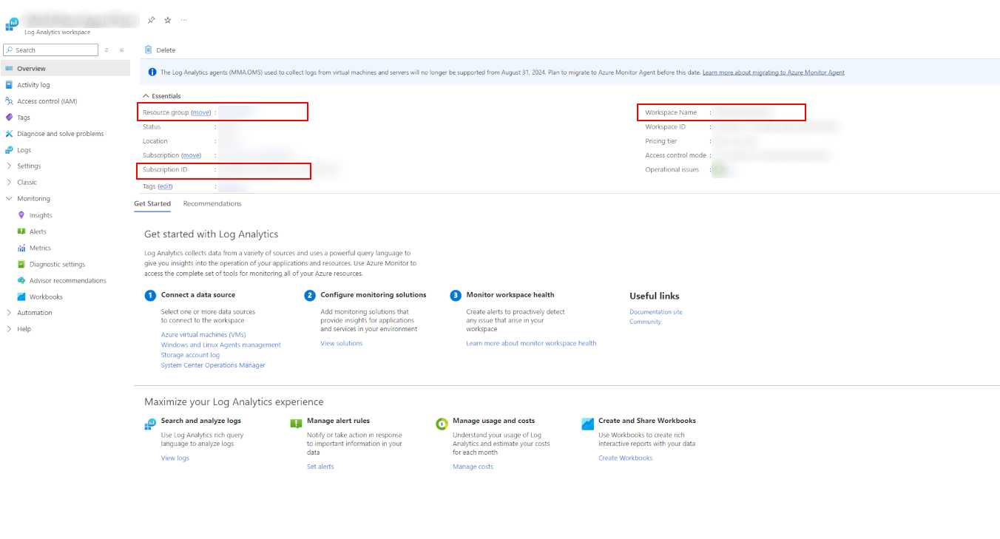

## Connecting Uber Agent Metrics to Azure Workbook


This document will walk you through the steps to connect "UberAgent" installed in your Citrix components to the Azure Workbook through Azure Log Monitor and visualize them in a dashboard. 

### Table of contents
- [Connecting Uber Agent Metrics to Azure Workbook](#connecting-uber-agent-metrics-to-azure-workbook)
  - [Table of contents](#table-of-contents)
  - [Creating Azure Log Analytics workspace](#creating-azure-log-analytics-workspace)
  - [Integrating uberAgent with Log Analytics workspace](#integrating-uberagent-with-log-analytics-workspace)
  - [Import Azure workbook templates to your Azure Log Analytics Workspace](#import-azure-workbook-templates-to-your-azure-log-analytics-workspace)
    - [Step 1 - Create a new "Log analytics workspace" in Azure or use an existing one](#step-1---create-a-new-log-analytics-workspace-in-azure-or-use-an-existing-one)
    - [Step 2 - Use the powershell script to import the templates to your workspace](#step-2---use-the-powershell-script-to-import-the-templates-to-your-workspace)

### Creating Azure Log Analytics workspace

1. Log in to the Azure portal
2. In all services, search for Log Analytics workspaces.
 
3. Create a new workspace within the desired Subscription and Resource group

### Integrating uberAgent with Log Analytics workspace

1. Once uberAgent is installed in the required machine, go to the installed location. (By default would be : `C:\Program Files\vast limits\uberAgent`)
2. Open the `uberAgent.conf` file and add the following Receiver entry in it. 

```
[Receiver]
Name = Default
Type = OMSLogAnalytics
Protocol = HTTP				
Servers = https://<log-analytics-workspace-id>.ods.opinsights.azure.com
RESTToken = <log-analytics-primary key>
```
* Workspace ID and Primary Key can be found in : Settings →  Agents → Log Analytics agent instructions
 

3. Restart the uberAgent service, and it should start sending data to the Log Analytics workspace.
4. Verify if the data is received in Logs → Custom Logs to see the tables created
 
   


### Import Azure workbook templates to your Azure Log Analytics Workspace

#### Step 1 - Create a new "Log analytics workspace" in Azure or use an existing one


* Navigate to the azure portal
* Search for "Log analytics workspace" and go to the dedicated page
* Click on the workspace to which you are sending the data (Configured in previous section)
* Note down the "Resource Group", "Workspace Name" and "Subscription ID"
* Make sure your account has the necessary permissions to create a new workspace to CLI
  

 


#### Step 2 - Use the powershell script to import the templates to your workspace

* Open "Powershell"
* Make sure you have the [Azure CLI](https://learn.microsoft.com/en-us/cli/azure/) installed in your machine
* Login to your account by running `az login`
* Navigate to the AzureWorkbook folder
* run the powershell script by running `.\ImportWorkbooks.ps1`
* It will ask for "Subscription Id", "Resource Group Name" and "Workspace Name"
* You can copy the values from Azure Portal and paste them in the CLI by mouse right click
* The script will import the templates to your Azure Workbooks