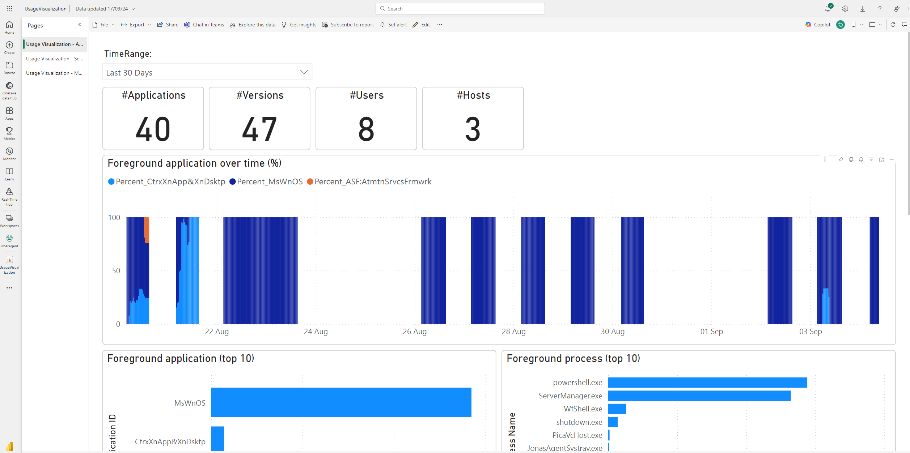

## How to use the PowerBI template

For PowerBI, an example template file (.pbit) is provided.
The file includes a set of pre-built example reports based on the collected uberAgent metrics.
The reports reference datasets which are generated from Kusto queries to the Log Analytics workspace which is configured to collect uberAgent metrics.

### Table of contents
  - [Creating Azure Log Analytics workspace](#creating-azure-log-analytics-workspace)
  - [Integrating uberAgent with Log Analytics workspace](#integrating-uberagent-with-log-analytics-workspace)
  - [Loading the template](#loading-the-template)
    - [Troubleshooting](#troubleshooting)
  - [Publishing the template](#publishing-the-template)
  - [Dashboard preview](#dashboard-preview)
  - [Configured scheduled refresh](#configured-scheduled-refresh)

### Creating Azure Log Analytics workspace

[Creating Azure Log Analytics workspace](../README.md#creating-azure-log-analytics-workspace)

### Integrating uberAgent with Log Analytics workspace

[Integrating uberAgent with Log Analytics workspace](../README.md#integrating-uberagent-with-log-analytics-workspace)

### Loading the template

- Open PowerBI desktop.  
  Note that the template was created with PowerBI version 2.132.1053.0 64-bit (August, 2024). You may need to upgrade to successfully open the template file.
- Navigate to "File" > "Import" > "Power BI Template" and select the .pbit file downloaded from the Github repository.
- Upon the importing, you will be prompted to provide the Log Analytics connection string, captured as a parameter named "LAConnection".
   
- The value should look like `https://api.loganalytics.io/v1/workspaces/workspace-id/query`.
  
- When prompted, authenticate as needed to access the Web Content and click "Connect".
- A series of datasets will be refreshed, which may take some time, depending on the size of the uberAgent datasets.

#### Troubleshooting
- In case the dataset refresh fails with error: "_Query references other queries or steps, so it may not directly access a data source. Please rebuild this data combination._", please try the following:
    - Navigate to "File" > "Options and settings" > "Options" > "Current File" > "Privacy" > select "Ignore the Privacy Levels" > Click "OK".
    - At the top Home menu, click on "Refresh" to refresh the datasets.

### Publishing the template

You can review the report set included in the template and optionally make enhancements. Once done, you can publish the reports to your PowerBI workspace:
- Click the "Publish" button which is part of the "Home" menu.
    
- Save the project as a .pbix file.
- Select the workspace to publish to.

Reference: https://learn.microsoft.com/en-us/power-bi/create-reports/desktop-upload-desktop-files

### Dashboard preview

### Configured scheduled refresh

In the PowerBI workspace, you can configure a scheduled refresh of the semantic model, e.g. once per day.
- In the workspace, select the uberAgent semantic model.
- On the top menu, select "Refresh" > "Schedule refresh".
- A series of options appear. Click on the "Refresh".
- Enable the refresh schedule toggle.
- Configure the schedule and click "Apply"

Reference: https://learn.microsoft.com/en-us/power-bi/connect-data/refresh-scheduled-refresh